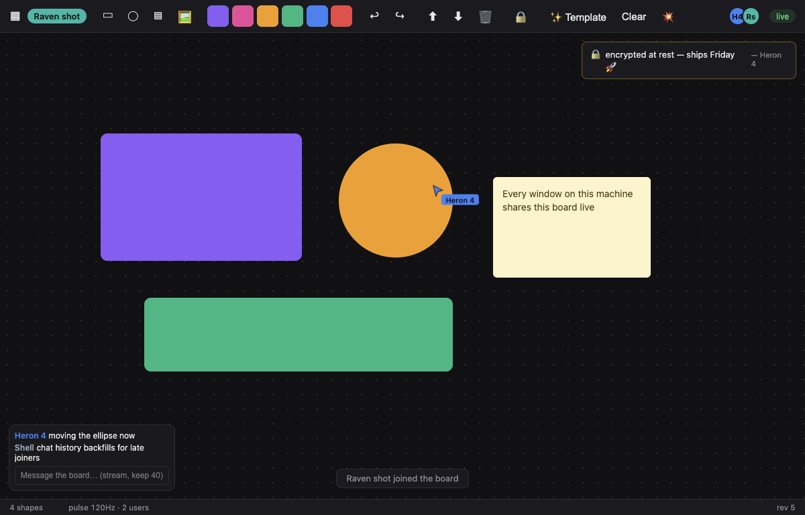

# bellstate — Electron State Management & Real-Time Sync Between Desktop Apps

[](https://github.com/lithometric/bellstate/actions/workflows/ci.yml)
[](https://www.npmjs.com/package/bellstate)
[](LICENSE)


**Machine-global state for Electron and Node.js processes.** One store, every process, one source of truth — backed by a small Rust daemon. bellstate is an Electron state manager, a cross-process IPC alternative, a local real-time sync engine, and a multiplayer backend that runs entirely on the user's machine.

Separate Electron apps, background helpers, CLIs, and shells on the same computer read and write the same live store. Changes propagate to every subscriber in **~0.05 milliseconds**. Writes are atomic (`incr`, `update`, `merge`, `mset`), state survives `kill -9` via a write-ahead log, and a transient pulse lane streams cursors and drag motion at **120Hz+ per user** — 4× the ~30Hz cursor rate Figma's multiplayer servers coalesce to, because bellstate never leaves the machine.



*MultiBoard, the example app: two Electron processes sharing live cursors, presence, chat with backfill, an encrypted-at-rest note, and 120Hz drag sync — all through one local daemon, no server.*

<!-- DEMO VIDEO SLOT ─ drop a screen recording of two MultiBoard windows here.
     Easiest reliable way on GitHub: edit this README on github.com and drag the
     .mp4/.mov straight into the editor — GitHub hosts it and inserts a playable
     link. (A .mp4 committed into docs/ will NOT autoplay inline.)
     Alternative: convert to docs/demo.gif (< 10MB) and embed:
                                            -->

```
  Electron App A          Electron App B          npx bellstate watch
  ┌────────────┐          ┌────────────┐          ┌────────────┐
  │  renderer  │          │  renderer  │          │            │
  │     ↕ IPC  │          │     ↕ IPC  │          │  CLI       │
  │   main ────┼──┐    ┌──┼─── main    │       ┌──┼──          │
  └────────────┘  │    │  └────────────┘       │  └────────────┘
                  ▼    ▼                       ▼
              ┌─────────────────────────────────────┐
              │       bellstated  (Rust daemon)     │
              │  unix socket / named pipe · NDJSON  │
              │  per-key revisions · CAS · pub/sub  │
              │  pulse lane · streams · WAL · TTL   │
              └─────────────────────────────────────┘
```

## Why does this exist?

Electron gives you IPC *inside* one app. It gives you **nothing between apps**. If you ship two desktop apps (or an app + a menu-bar companion + a CLI + a background updater) that need shared settings, session state, auth tokens, presence, or coordination, you end up hand-rolling lock files, polling JSON on disk, or running a local HTTP server. bellstate replaces all of that with one primitive: a machine-global key/value store with subscriptions, atomic writes, encrypted values, and process presence.

- **Synchronous reads** — each client keeps a local replica updated by daemon broadcasts; `store.get(key)` never blocks.
- **No lost updates** — per-key revisions + compare-and-set; `update(key, fn)` retries automatically; `incr` is atomic; `merge` is per-property last-writer-wins (the same conflict model Figma described for its multiplayer editor); `mset` writes many keys in one revision.
- **Crash-safe** — every mutation hits a write-ahead log (compacted into snapshots), so even `kill -9` loses at most a few milliseconds. Clients auto-respawn a dead daemon, resync, re-claim ephemeral keys, and flush their offline write queue.
- **Real-time, actually** — the pulse lane (fire-and-forget fan-out, no revision, no disk) benchmarks at **~350,000 messages/sec** with 0.05ms median latency. Every user streams cursors and drags at display refresh rate.
- **Knows who's running** — ephemeral keys die with their connection: presence, machine-global locks (`acquire`), and single-instance coordination fall out for free. TTL keys expire on their own.
- **Secrets stay secret** — `{secure: true}` values are AES-256-GCM ciphertext on disk, in the WAL, and to any client without the key.
- **Per-user undo/redo** — Figma-style multiplayer undo: reverting *your* ops without touching anyone else's.
- **Zero npm dependencies** — the client is plain Node.js; the daemon is one static Rust binary.

## Who is this for? (use cases)

These are the patterns real desktop companies build by hand today — bellstate is that layer, packaged:

- **App suites** (the Notion / Notion Calendar / Notion Mail or Adobe Creative Cloud shape): shared auth/session, current-workspace state, and cross-app presence between separately shipped Electron apps.
- **Password managers & security tools** (the 1Password shape): a vault lock/unlock flag that propagates to the main window, mini window, and browser-helper process in under a millisecond — with `{secure: true}` for the tokens themselves.
- **Voice/call apps with overlays** (the Discord / Slack huddle shape): mute/deafen state identical everywhere instantly; live voice-activity meters on the pulse lane.
- **Screen recorders** (the Loom / Screen Studio shape): recorder, floating control bar, and camera bubble are separate windows — recording state in the store, timers and audio levels as pulses.
- **AI meeting copilots & desktop assistants** (the Cluely-style overlay shape): "is the assistant listening" as a KV flag, live transcript tokens as a stream with `keep` history so an overlay opened mid-meeting backfills instantly.
- **Local AI frontends** (the LM Studio / Ollama shape): model-loaded state in KV, token streams as pulses.
- **Design tools & whiteboards** (the Figma / Canva / Miro / tldraw shape): multiplayer canvas between windows — that's literally the included example app.
- **Game launchers** (the Steam / Epic shape): download progress fan-out, "only one updater runs" locks, license state.

## Quickstart (Electron)

```bash
npm install bellstate
```

**Main process:**

```js
const { app } = require('electron');
const { initBellstate } = require('bellstate/main');

app.whenReady().then(async () => {
  const store = await initBellstate({ namespace: 'my-suite' });

  store.get('user');                        // sync read from the replica
  await store.set('user', { id: 42 });      // acknowledged write
  await store.incr('launches');             // atomic, cross-process
  await store.merge('prefs', { theme: 'dark' }); // per-property, conflict-free
  await store.presence('main-app');         // visible to every process
  store.watch('settings:*', ({ key, value }) => { /* live */ });
});
```

**Preload:** `require('bellstate/preload').exposeBellstate();` → `window.bellstate` in the renderer.

> Requiring an npm package from a preload needs `sandbox: false` in the window's `webPreferences` (context isolation stays on — that's the real boundary).

**Renderer:**

```js
await window.bellstate.set('theme', 'dark');
await window.bellstate.incr('counter');            // safe under concurrent clicks
window.bellstate.watch('theme', ({ value }) => applyTheme(value));
window.bellstate.pulse('cursor:me', { x, y });     // 120Hz transient lane
```

`npm install bellstate` ships a prebuilt daemon for **macOS (arm64 + x64), Linux (x64 + arm64, static musl), and Windows (x64)** via per-platform optional dependencies, esbuild-style — no toolchain needed.

## Framework bindings (React, Vue, Svelte, Angular — Vite-ready)

Thin renderer-side adapters over the `window.bellstate` preload bridge. Each is a plain module with no Node-specific code, so they work with Vite, webpack, esbuild, or no bundler at all:

- **React** — `npm install bellstate-react`: `const [todos, setTodos] = useBellstate('todos', [])`, plus `useBellstateIncr(key)`, `useBellstateStatus()`, `useBellstateRev()`.
- **Vue 3** — `npm install bellstate-vue`: `const theme = useBellstate('theme', 'light')` returns a writable computed ref — `v-model` works across every app on the machine.
- **Svelte** — `npm install bellstate-svelte`: `const theme = bellstateStore('theme')` → `$theme`, `bind:value`. Zero dependencies (plain store contract, Svelte 3–5).
- **Angular 16+** — `npm install bellstate-angular`: `counter = bellstateSignal('counter', 0)` returns a `Signal<T>`, plus `setBellstate`, `incrBellstate`, `bellstateConnected()`.

All four share one renderer replica (one snapshot + one subscription per window), and every value updates live when **any process on the machine** writes it.

## Quickstart (plain Node.js)

```js
const { connect } = require('bellstate');
const store = await connect({ namespace: 'my-suite' });
await store.set('jobs:pending', 3);
store.on('change', ({ key, value, rev }) => console.log(key, value, rev));
```

## CLI — your shell is just another client

```bash
npx bellstate set theme dark
npx bellstate watch 'presence:*'      # live event stream
npx bellstate incr counter
npx bellstate merge user '{"plan":"pro"}'
npx bellstate hist transcript         # stream history
npx bellstate dump / stats / shutdown
```

## Coordination between processes

```js
await store.presence('editor', { version: app.getVersion() });
store.peers();                                   // who's running right now?

if (await store.acquire('lock:migration')) {      // machine-global lock,
  await runMigration();                           // auto-released if the
  await store.release('lock:migration');          // holder crashes
}

await store.set('toast', 'Saved!', { ttl: 5000 });        // self-expiring
await store.set('session', token, { ephemeral: true });    // dies with process
```

Ephemeral keys re-claim automatically after a daemon restart; if the re-claim loses (someone else took the lock), the client emits `'ephemeral-lost'`.

## The transient lane, streams, and everything else

```js
// Pulse lane: fire-and-forget fan-out — no revision, no WAL, no ack.
// ~350k msgs/sec, ~0.05ms median latency. For cursors, drag motion, meters.
store.pulse('cursor:me', { x, y });
store.watchPulse('cursor:*', ({ ch, value }) => {});

// Streams: pulses with bounded in-memory history — late joiners backfill.
store.pulse('transcript', { text }, { keep: 100 });
const recent = await store.history('transcript');

// Per-user multiplayer undo (reverts YOUR ops only, as new ops):
store.enableUndo();
await store.undo();  await store.redo();

// Encrypted at rest (AES-256-GCM; ciphertext on disk and to key-less clients):
const store = await connect({ secure: true }); // or {secure: {keyFile}}
await store.set('session', token, { secure: true });

// Fractional-index ordering — concurrent list inserts without renumbering:
const { orderBetween } = require('bellstate');
item.pos = orderBetween(prev.pos, next.pos);

// Offline queue (on by default): unconditional writes issued while the
// daemon is unreachable are held and replayed after resync.
store.offlineQueueSize;
```

## How does bellstate compare?

| | scope | multiple Electron *apps*? | live subscriptions | atomic ops / CAS | transient 120Hz lane | runs offline / local |
|---|---|---|---|---|---|---|
| **bellstate** | machine-global | ✅ | ✅ | ✅ (`incr`, `merge`, `update`, `mset`) | ✅ | ✅ |
| electron-store | one app, on-disk config | ❌ | file watching only | ❌ | ❌ | ✅ |
| electron-redux / zustand-sync | windows of one app | ❌ | ✅ | ❌ | ❌ | ✅ |
| Redis (localhost) | machine-global | ✅ | ✅ (pub/sub) | ✅ | partial | ✅ but heavyweight install |
| Yjs / Automerge (CRDTs) | document sync | needs your own provider | ✅ | CRDT semantics | ❌ | ✅ |
| Liveblocks / PartyKit | cloud multiplayer | via internet | ✅ | ✅ | throttled (~60Hz max) | ❌ |

If you need cloud multiplayer between *different machines*, use a sync service. If you need state shared between processes on *one* machine — settings sync, presence, locks, overlays, companion apps — a local daemon beats a round-trip to a server on latency (0.05ms vs 30–150ms), privacy, and offline behavior.

## The daemon

`bellstated` is a single async Rust binary (tokio) on a Unix domain socket (named pipe on Windows), speaking newline-delimited JSON (protocol v1, `hello`-negotiated). Per-key revisions anchor compare-and-set; values over 512KB transfer in chunks so an 8MB write never blocks a 20-byte one; slow consumers are evicted instead of ballooning memory; the WAL compacts at 4MB with optional `--fsync`. You never start it by hand — the first client spawns it, and any client respawns it if it dies.

The full wire protocol is documented in this README's history and the source — speak it from Python, Go, or Swift in an afternoon: `hello`, `get`, `set` (with `ifRev`/`ttl`/`ephemeral`), `merge`, `incr`, `mset`, `del`, `clear`, `snapshot`, `keys`, `sub`/`unsub`, `pulse`/`hist`, `bset`/`bchunk`/`bcommit`/`bget`, `ping`, `stats`, `shutdown`.

## Examples

The `examples/` folder holds **standalone Electron apps** that install bellstate from a packed tarball — exactly the way a real consumer runs `npm install bellstate`:

- **`examples/electron-app` — MultiBoard**: the Figma-style multiplayer canvas in the screenshot above. Live cursors (pulse lane), presence avatars, drag locking (`acquire`), conflict-free edits (`merge`), per-user undo (⌘Z), chat with stream backfill, an encrypted vault note, fractional-index z-order, TTL toasts, and a 💥 button that SIGKILLs the daemon to show WAL recovery + the offline queue.
- **`examples/roy-app`**: a minimal TypeScript Electron app sharing a todo list.

```bash
cd packages/bellstate && npm pack        # refresh the tarball after changes
cd ../../examples/electron-app
npm install && npm start                 # + `npm run start2` for a second user
```

## FAQ

**How do I sync state between two Electron apps?**
`npm install bellstate` in both, call `initBellstate({ namespace: 'shared' })` in each main process. Both apps now read/write one live store — no server, no polling, no custom IPC.

**How do I share state between Electron windows?**
The main-process helper bridges the store to every `BrowserWindow` automatically; renderers use `window.bellstate`. Works across windows *and* across separate apps.

**Is this a Redis alternative for desktop apps?**
For machine-local use, yes: key/value + pub/sub + atomic ops + TTL, but zero-install (the binary ships in the npm package), crash-respawning, and Electron-native.

**How fast is it?**
Benchmarked on the included suite: ~350k transient messages/sec, ~200k durable writes/sec, 0.05ms median latency. Enough headroom for ~2,900 processes streaming at 120Hz.

**Does it work offline?**
It *only* works offline — nothing ever leaves the machine. Writes made while the daemon is down queue and replay.

**macOS, Windows, Linux?**
All three. Unix sockets on macOS/Linux, named pipes on Windows; CI runs the full 25-step suite on each. Prebuilt `bellstated` binaries ship for macOS arm64/x64, Linux x64/arm64 (statically linked musl — runs on any distro), and Windows x64 as `bellstate-<platform>-<arch>` optional dependencies; the right one installs automatically.

## In the wild

*Building something on bellstate, or covered it somewhere? Open a PR and add the link here.*

## Development & publishing

```bash
npm test        # cargo-builds the daemon, runs the 25-step e2e suite
```

The e2e suite is the contract: CAS under contention (2×30 concurrent `update()`s, zero lost), 2×100 concurrent `incr`s → exactly 200, concurrent `merge`s combining per-property, mset atomicity, stream backfill, per-user undo, ciphertext-on-disk verification, ordering through 50 nested fractional inserts, SIGKILL → WAL recovery, lock re-claim, offline queue flush.

The `Publish to npm` workflow builds `bellstated` for macOS x64/arm64, Linux x64/arm64, and Windows x64, publishes per-platform binary packages, injects them as `optionalDependencies`, and publishes `bellstate` plus the framework packages (`bellstate-react`, `bellstate-vue`, `bellstate-svelte`, `bellstate-angular`) — so `npm install bellstate` ships the right daemon everywhere, esbuild-style. The same flow runs locally by cross-compiling with `cargo zigbuild` and running `node scripts/gen-platform-packages.js <binaries-dir> --inject` before `npm publish`.

## Roadmap

- Change history / time-travel debugging on top of the WAL
- Optional MessagePack framing for high-throughput workloads
- Keychain-backed (`safeStorage`) key management for secure values

## License

MIT

---

*Topics: electron state management · sync state between electron windows · share state between electron apps · electron IPC alternative · cross-process state sync · real-time desktop sync engine · local-first multiplayer · figma-style multiplayer cursors · electron global store · rust daemon for node.js · machine-global key-value store · electron presence and locks · encrypted electron settings · electron collaborative canvas · desktop pub/sub*
